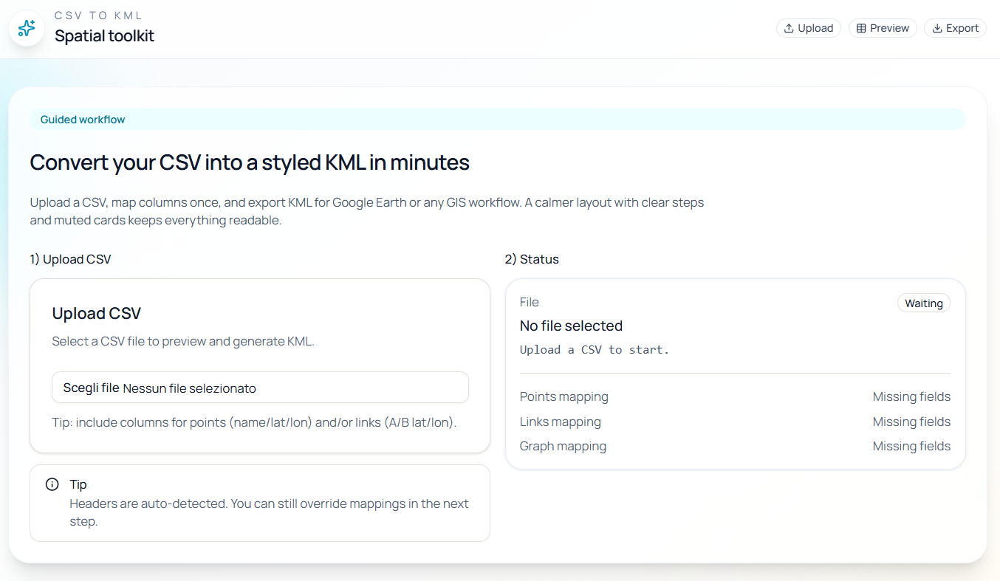
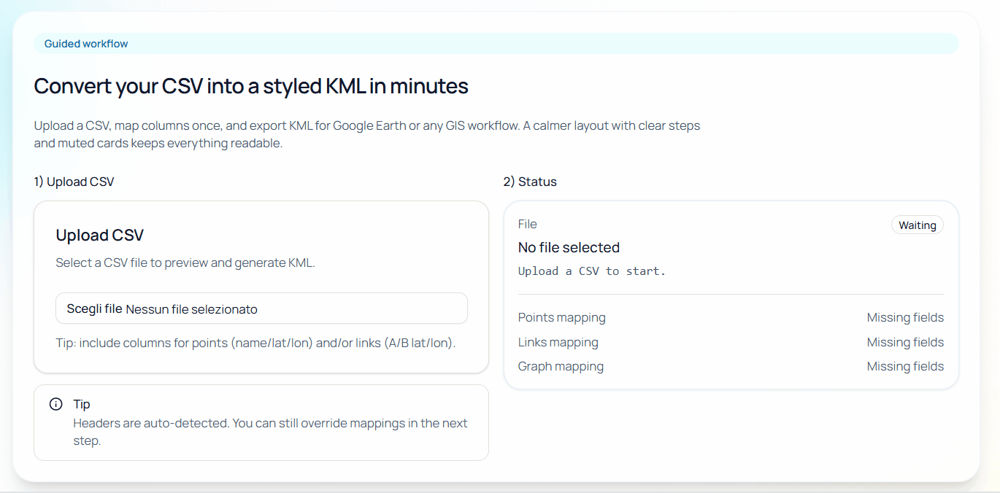
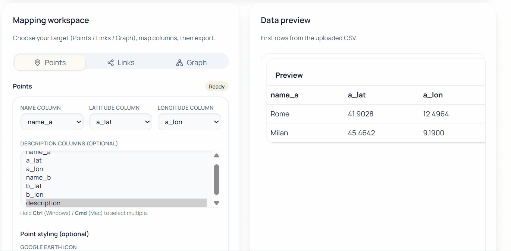

# csv2kml


csv2kml is a web application that converts CSV files into KML files, allowing
full control over how CSV columns are mapped to KML points and links.

It is designed both as:
- a practical tool for GIS / network planning workflows
- a learning playground for software engineering and DevOps best practices

---

## ✨ Features

### CSV → KML Points
- Upload a CSV file and preview its content
- Map CSV columns to:
  - point name
  - latitude
  - longitude
  - description (optional, built from multiple columns)
- Customize point style:
  - icon URL
  - color
  - scale

### CSV → KML Links (LineString)
- Generate connections between two endpoints (A → B)
- Map CSV columns for:
  - endpoint A (lat / lon)
  - endpoint B (lat / lon)
- Customize line style:
  - color
  - width

### Graph Mode (Points + Links together)
- Generate points and links in a single KML
- Automatic point deduplication
- Useful for network topology visualization

---

## 📸 Screenshots

| Upload & Preview                          | Points Mapping                            |
| ----------------------------------------- | ----------------------------------------- |
|  |  |

| Links Mapping                           | Graph Mode                              |
| --------------------------------------- | --------------------------------------- |
|  |  |

| Demo Google-Earth                   |
| ----------------------------------- |
|  |

---

## 📂 Example CSV files

Ready-to-use example CSV files are available in the [`examples/`](./examples) folder:

- `points_simple.csv`
- `links_simple.csv`
- `graph_points_and_links.csv`

Each file is documented in [`examples/README.md`](./examples/README.md).

---

## 🏗 Tech Stack

### Backend
- Python
- FastAPI
- Pydantic
- Pytest

### Frontend
- React + TypeScript
- Vite
- Tailwind CSS
- shadcn/ui

### DevOps
- Docker & docker-compose
- GitHub Actions CI:
 - backend tests (pytest)
 - frontend build check

---

## 🚀 Quickstart (Docker)

Requirements:
- Docker
- Docker Compose

Run the full stack:

```bash
docker compose up --build
```

Then Open:
- Frontend: http://localhost:5173
- Backend (optional): http://localhost:8000

Stop:
```bash
docker compose down
```

---

## Local Development (optional)

### Backend
```bash
cd backend
python -m venv .venv
source .venv/bin/activate   # Windows: .\.venv\Scripts\activate
pip install -r requirements.txt
uvicorn app.main:app --reload
```

### Frontend
```bash
cd frontend
npm install
npm run dev
```

---

## Project Goals
This project is also meant to practice:
- clean architecture and separation of concerns
- frontend/backend contracts
- testing and validation
- containerization and reproducible environments
- professional Git workflows

---

## License
MIT

